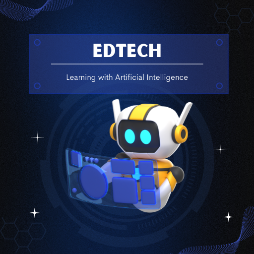
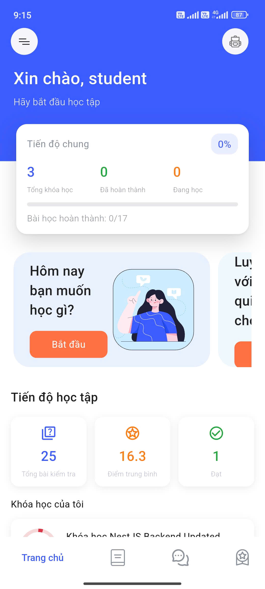
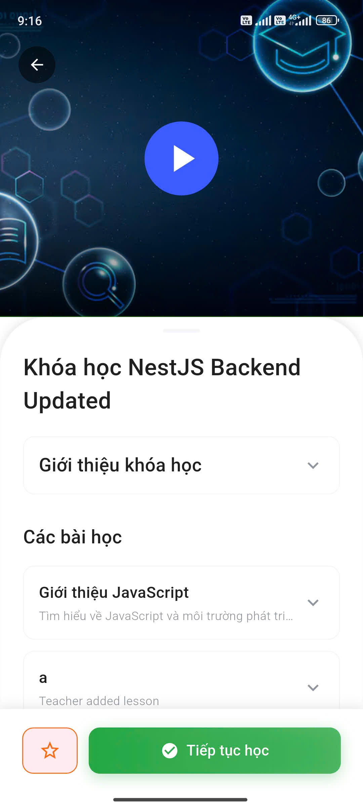
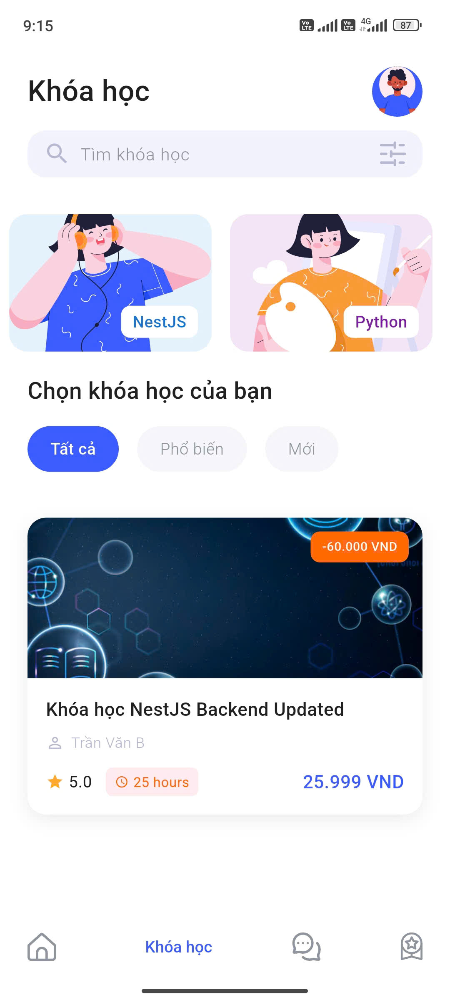

# 🎓 EdTech - Ứng dụng Học tập Trực tuyến Thông minh

<div align="center">
  
  
  **Học tập hiệu quả với hệ thống AI thông minh**
  
  [](https://flutter.dev/)
  [](https://dart.dev/)
  [](https://firebase.google.com/)
  [](https://bloclibrary.dev/)
  
  [](https://play.google.com/store/apps/details?id=com.nguyenduc.edtech.ed_tech)
</div>

---

## 📖 Giới thiệu

**EdTech** là một ứng dụng học tập trực tuyến thông minh được xây dựng bằng Flutter, tích hợp công nghệ AI để mang lại trải nghiệm học tập hiện đại và cá nhân hóa cho học sinh, sinh viên và người đi làm. Ứng dụng tự động phân tích thói quen học tập, năng lực và tiến độ của người dùng để đưa ra lộ trình học tập phù hợp nhất.

### ✨ Điểm nổi bật

- 🤖 **AI-Powered Learning**: Học tập thích ứng với AI phân tích năng lực và gợi ý khóa học phù hợp
- 👥 **Đa vai trò**: Hỗ trợ 3 vai trò người dùng (Student, Teacher, Admin) với quyền hạn riêng biệt
- 📊 **Theo dõi tiến độ**: Báo cáo chi tiết, xuất file PDF/Excel, bảng điểm tự động
- 💬 **Chatbot AI**: Trợ lý học tập 24/7 hỗ trợ giải đáp thắc mắc
- 💳 **Thanh toán tích hợp**: Hỗ trợ nhiều phương thức thanh toán an toàn
- 🌐 **Đa ngôn ngữ**: Hỗ trợ tiếng Việt và tiếng Anh 

---

## 📸 Ảnh Demo

<div align="center">
  <table>
    <tr>
      <td align="center">
        
        <br><b>Trang chủ</b>
      </td>
      <td align="center">
        
        <br><b>Khóa học</b>
      </td>
      <td align="center">
        
        <br><b>Tìm kiếm</b>
      </td>
      <td align="center">
        
        <br><b>Chatbot AI</b>
      </td>
    </tr>
  </table>
</div>

---

## 🚀 Tính năng chính

### 🔐 Xác thực & Phân quyền
- Đăng ký, đăng nhập với email/password
- Xác thực qua Firebase Authentication
- Đăng nhập bằng Google
- Phân quyền theo vai trò: **Student**, **Teacher**, **Admin**
- Quên mật khẩu và đặt lại mật khẩu

### 📚 Quản lý Khóa học
- Duyệt và tìm kiếm khóa học
- Xem chi tiết khóa học với video bài giảng
- Quản lý nội dung học tập (cho Teacher/Admin)
- Tạo và chỉnh sửa khóa học
- Lọc và sắp xếp khóa học theo nhiều tiêu chí

### 📝 Đánh giá & Kiểm tra
- Làm bài kiểm tra trực tuyến
- Chấm điểm tự động
- Lưu kết quả và lịch sử làm bài
- Xem bảng điểm chi tiết
- Xuất báo cáo PDF/Excel

### 📊 Theo dõi Tiến độ
- Báo cáo tiến độ học tập chi tiết
- Thống kê số giờ học, số bài đã hoàn thành
- Biểu đồ tiến độ trực quan
- Xuất file PDF/Excel báo cáo

### 💬 Chatbot AI
- Trợ lý học tập thông minh 24/7
- Hỗ trợ giải đáp thắc mắc về bài học
- Lịch sử chat được lưu trữ
- Tích hợp AI để đưa ra gợi ý học tập

### 💳 Thanh toán
- Thanh toán khóa học trực tuyến
- Hỗ trợ nhiều phương thức thanh toán
- Quản lý hóa đơn và lịch sử giao dịch
- Xác nhận thanh toán tự động

### 🎯 Học tập Thích ứng
- Gợi ý khóa học dựa trên năng lực
- Phân tích thói quen học tập
- Lộ trình học tập cá nhân hóa
- Đề xuất nội dung phù hợp

### 👥 Cộng đồng
- Tạo nhóm học tập
- Kết nối với bạn học
- Chia sẻ tài liệu và kinh nghiệm
- Tương tác trong cộng đồng

### ⚙️ Quản trị (Admin)
- Quản lý người dùng
- Kiểm duyệt nội dung khóa học
- Quản lý tài chính và báo cáo
- Cấu hình hệ thống

---

## 🛠 Công nghệ sử dụng

### Framework & Ngôn ngữ
- **Flutter** `3.29.2` - Framework đa nền tảng
- **Dart** `^3.7.2` - Ngôn ngữ lập trình
- **JDK** `17` - Java Development Kit
- **Xcode** `15.2` - IDE cho iOS

### State Management
- **flutter_bloc** `^8.1.5` - Quản lý state với BLoC pattern
- **disposable_provider** `^2.4.0` - Dependency injection

### Networking & API
- **dio** `^5.4.3+1` - HTTP client
- **connectivity_plus** `^6.0.3` - Kiểm tra kết nối mạng

### Authentication & Storage
- **firebase_core** `^4.0.0` - Firebase Core
- **firebase_auth** `^6.0.1` - Firebase Authentication
- **google_sign_in** `^6.3.0` - Đăng nhập Google
- **flutter_secure_storage** `^9.2.0` - Lưu trữ an toàn
- **shared_preferences** `^2.5.3` - Lưu trữ local
- **hive_ce_flutter** `^2.3.1` - NoSQL database local

### UI/UX
- **easy_localization** `^3.0.7+1` - Đa ngôn ngữ
- **responsive_framework** `^1.5.1` - Responsive design
- **salomon_bottom_bar** `^3.3.2` - Bottom navigation bar
- **shimmer** `^3.0.0` - Loading shimmer effect
- **cached_network_image** `^3.3.1` - Cache hình ảnh
- **flutter_svg** `^2.2.0` - Hiển thị SVG

### Media
- **video_player** `^2.10.0` - Phát video
- **chewie** `^1.8.5` - Video player UI
- **youtube_player_flutter** `^9.0.0` - YouTube player

### Utilities
- **fluttertoast** `^8.2.12` - Toast notifications
- **url_launcher** `^6.3.1` - Mở URL/links
- **webview_flutter** `^4.10.0` - WebView
- **flutter_html** `^3.0.0` - Render HTML
- **pin_code_fields** `^8.0.1` - OTP input
- **u_credit_card** `^1.4.0` - Credit card UI

---

## 📥 Cài đặt

### Yêu cầu hệ thống
- Flutter SDK `>=3.7.2`
- Dart SDK `>=3.7.2`
- Android Studio / VS Code với Flutter extension
- JDK 17 hoặc cao hơn
- Xcode 15.2 (cho iOS development)

### Các bước cài đặt

1. **Clone repository**
```bash
git clone https://github.com/your-repo/Edu-Tech.git
cd Edu-Tech
```

2. **Cài đặt dependencies**
```bash
flutter pub get
```

3. **Cấu hình môi trường**
   - Tạo file `.env` trong thư mục `env/`
   - Thêm các biến môi trường cần thiết (API keys, Firebase config, etc.)

4. **Chạy ứng dụng**
```bash
# Android
flutter run

# iOS
flutter run -d ios

# Web
flutter run -d chrome
```

### Build ứng dụng

```bash
# Android APK
flutter build apk --release

# Android App Bundle
flutter build appbundle --release

# iOS
flutter build ios --release
```

---

## 📱 Tải xuống

Ứng dụng đã có sẵn trên Google Play Store:

[](https://play.google.com/store/apps/details?id=com.nguyenduc.edtech.ed_tech)

Hoặc truy cập trực tiếp: [https://play.google.com/store/apps/details?id=com.nguyenduc.edtech.ed_tech](https://play.google.com/store/apps/details?id=com.nguyenduc.edtech.ed_tech)

---

## 👥 Thành viên phát triển

| Thành viên | Vai trò |
|------------|---------|
| **Nguyễn Minh Đức** | Developer & Project Lead |
| **Trần Văn Huy** | Developer |
| **Đinh Trần Đức** | Developer |

---

## 📄 License

Dự án này được phát hành dưới giấy phép MIT. Xem file [LICENSE](LICENSE) để biết thêm chi tiết.

---

## 🎯 Đề tài

**Ứng dụng AI trong xây dựng hệ thống học tập trực tuyến thông minh, quản lý người dùng**

---

## 📞 Liên hệ

- **Email**: ngminhducdev@gmail.com
- **Phone**: +84916562796
- **Google Play**: [EdTech App](https://play.google.com/store/apps/details?id=com.nguyenduc.edtech.ed_tech)

---

## 🙏 Lời cảm ơn

Cảm ơn tất cả những người đã đóng góp và sử dụng ứng dụng EdTech!

---

<div align="center">

**⭐ Nếu bạn thấy dự án này hữu ích, hãy cho chúng tôi một star! ⭐**

Made with ❤️ by EdTech Team

</div> 
